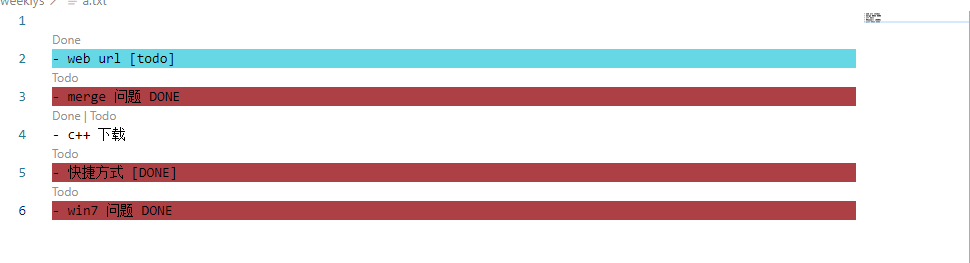

# kfmd

This is the README for your extension "kfmd"
## Features

- help you manager you markdown todo list by codelen
- give lines endswith '[TODO]' or '[DONE]' a background color

## Preview

<!-- ## Requirements

If you have any requirements or dependencies, add a section describing those and how to install and configure them. -->

## Extension Settings

* `kfmd.active`: enable this extension
* `kfmd.disactive`: disable this extension

<!-- ## Known Issues

Calling out known issues can help limit users opening duplicate issues against your extension. -->

<!-- ## Release Notes

Users appreciate release notes as you update your extension.

### 1.0.0

Initial release of ...

### 1.0.1

Fixed issue #.

### 1.1.0

Added features X, Y, and Z. -->

-----------------------------------------------------------------------------------------------------------

<!-- ### For more information

* [Visual Studio Code's Markdown Support](http://code.visualstudio.com/docs/languages/markdown)
* [Markdown Syntax Reference](https://help.github.com/articles/markdown-basics/) -->

**Enjoy!**
